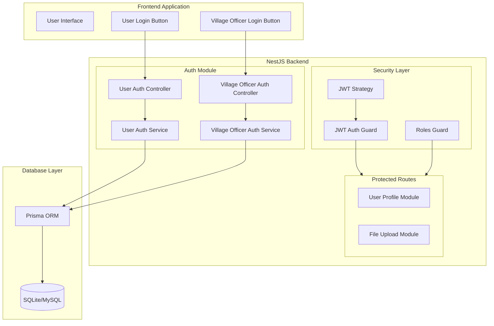
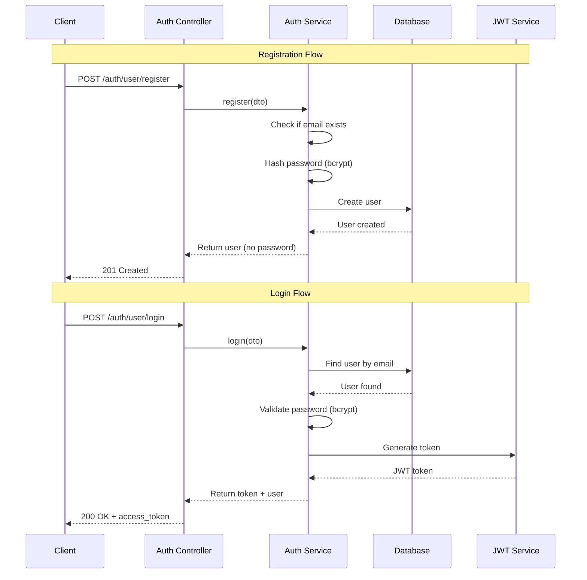
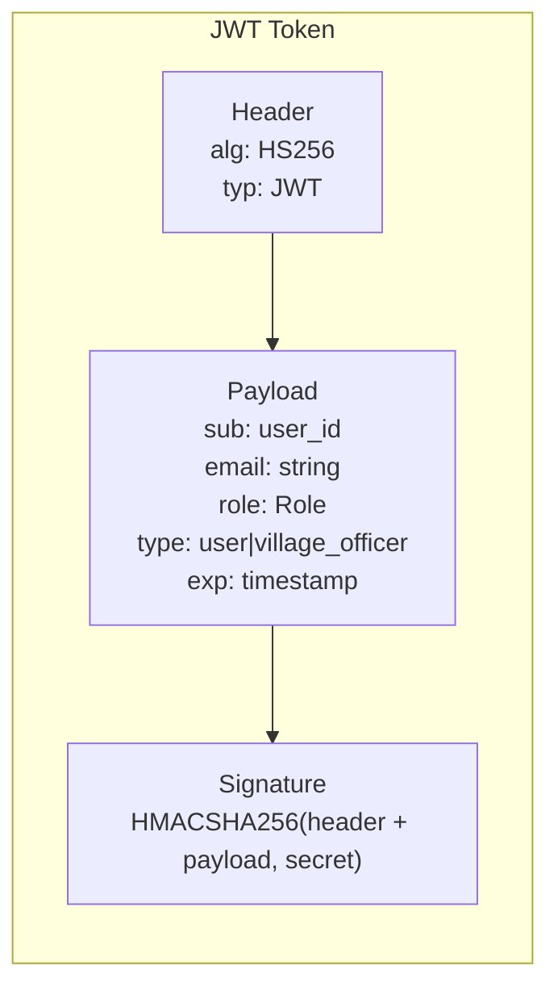
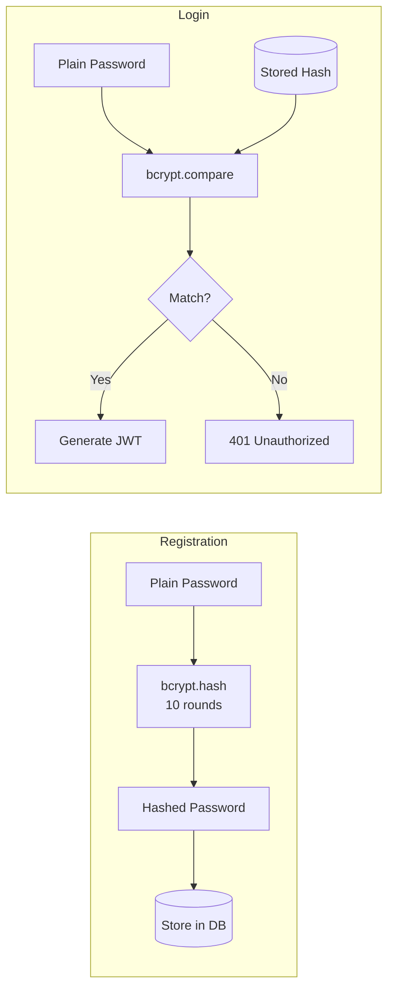
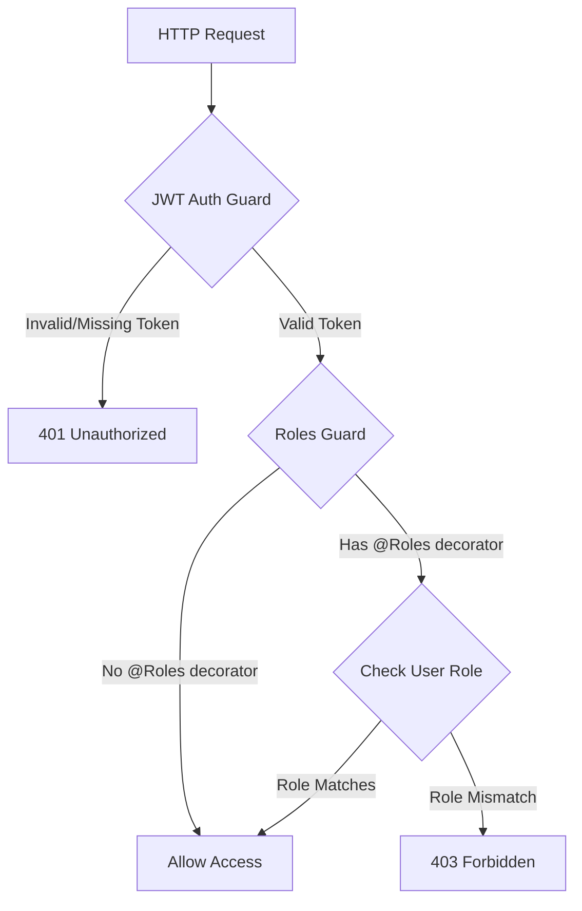
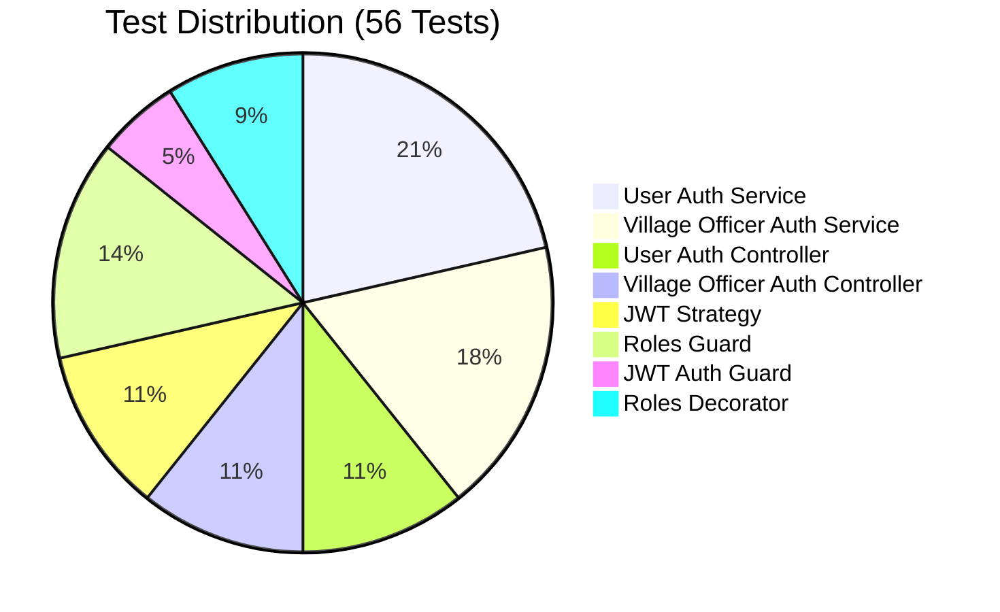
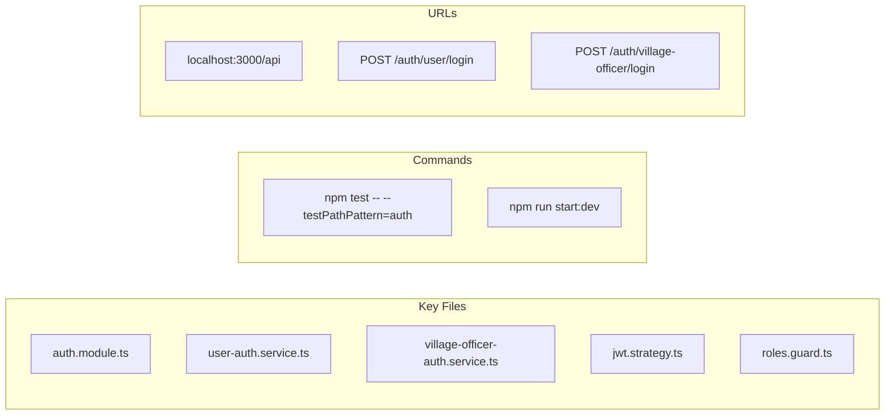

# Authentication & Authorization System

> **Version:** 1.0  
> **Created:** 2025-12-10  
> **Last Updated:** 2025-12-10

## Table of Contents
- [Overview](#overview)
- [Architecture](#architecture)
- [Project Structure](#project-structure)
- [Database Schema](#database-schema)
- [Authentication Flow](#authentication-flow)
- [API Endpoints](#api-endpoints)
- [Security Features](#security-features)
- [Guards & Decorators](#guards--decorators)
- [Testing Strategy](#testing-strategy)
- [Usage Examples](#usage-examples)

---

## Overview

This system implements **JWT-based authentication** with **role-based authorization** for two user types:

| Role | Description | Registration |
|------|-------------|--------------|
| **USER** | Regular citizens | Self-registration via UI |
| **VILLAGE_OFFICER** | Government village officers | Self-registration via UI |
| **ADMIN** | System administrators | API-only (not implemented yet) |

### Key Technologies
- **NestJS** - Backend framework
- **JWT (JSON Web Tokens)** - Stateless authentication
- **bcrypt** - Password hashing (10 salt rounds)
- **Passport.js** - Authentication middleware
- **Prisma** - Database ORM

---

## Architecture

### High-Level System Architecture



### Authentication Flow Diagram



---

## Project Structure

```
src/auth/
├── auth.module.ts                          # Module configuration
│
├── user-auth.service.ts                    # User authentication logic
├── user-auth.controller.ts                 # User API endpoints
├── user-auth.service.spec.ts               # User service tests
├── user-auth.controller.spec.ts            # User controller tests
│
├── village-officer-auth.service.ts         # Officer authentication logic
├── village-officer-auth.controller.ts      # Officer API endpoints
├── village-officer-auth.service.spec.ts    # Officer service tests
├── village-officer-auth.controller.spec.ts # Officer controller tests
│
├── dto/
│   ├── index.ts                            # Barrel exports
│   ├── login.dto.ts                        # Login request validation
│   ├── register-user.dto.ts                # User registration validation
│   └── register-village-officer.dto.ts     # Officer registration validation
│
├── enums/
│   ├── index.ts
│   └── role.enum.ts                        # Role definitions
│
├── strategies/
│   ├── jwt.strategy.ts                     # JWT validation strategy
│   └── jwt.strategy.spec.ts                # Strategy tests
│
├── guards/
│   ├── index.ts
│   ├── jwt-auth.guard.ts                   # Authentication guard
│   ├── jwt-auth.guard.spec.ts
│   ├── roles.guard.ts                      # Authorization guard
│   └── roles.guard.spec.ts
│
└── decorators/
    ├── index.ts
    ├── roles.decorator.ts                  # @Roles() decorator
    └── roles.decorator.spec.ts
```

---

## Database Schema

### Entity Relationship Diagram

```mermaid
erDiagram
    User {
        String id PK "UUID"
        String email UK "unique"
        String password "bcrypt hashed"
        Role role "USER, VILLAGE_OFFICER, ADMIN"
        DateTime createdAt
        DateTime updatedAt
    }
    
    VillageOfficer {
        String id PK "UUID"
        String email UK "unique"
        String password "bcrypt hashed"
        String fullName
        String district
        String division
        Role role "VILLAGE_OFFICER"
        DateTime createdAt
        DateTime updatedAt
    }
    
    UserProfile {
        String id PK "UUID"
        String userId FK UK "unique"
        String fullName
        String address
        String nic
        String email
        String telephone
        String district
        String division
        DateTime birthday
    }
    
    User ||--o| UserProfile : "has"
```

### Role Enum
```typescript
enum Role {
  USER = 'USER',
  VILLAGE_OFFICER = 'VILLAGE_OFFICER',
  ADMIN = 'ADMIN',
}
```

---

## Authentication Flow

### JWT Token Structure



### Token Payload Fields

| Field | Type | Description |
|-------|------|-------------|
| `sub` | string | User ID (UUID) |
| `email` | string | User's email address |
| `role` | Role | USER, VILLAGE_OFFICER, or ADMIN |
| `type` | string | 'user' or 'village_officer' |
| `exp` | number | Token expiration timestamp |

### Token Configuration
- **Secret:** Environment variable `JWT_SECRET` or default
- **Expiration:** 7 days
- **Algorithm:** HS256

---

## API Endpoints

### User Authentication

| Method | Endpoint | Description | Auth Required |
|--------|----------|-------------|---------------|
| POST | `/auth/user/register` | Register new user | No |
| POST | `/auth/user/login` | User login | No |

### Village Officer Authentication

| Method | Endpoint | Description | Auth Required |
|--------|----------|-------------|---------------|
| POST | `/auth/village-officer/register` | Register new officer | No |
| POST | `/auth/village-officer/login` | Officer login | No |

### Request/Response Examples

#### Register User
```http
POST /auth/user/register
Content-Type: application/json

{
  "email": "user@example.com",
  "password": "password123"
}
```

**Response (201):**
```json
{
  "message": "User registered successfully",
  "user": {
    "id": "uuid-here",
    "email": "user@example.com",
    "role": "USER",
    "createdAt": "2025-12-10T10:00:00.000Z"
  }
}
```

#### Login
```http
POST /auth/user/login
Content-Type: application/json

{
  "email": "user@example.com",
  "password": "password123"
}
```

**Response (200):**
```json
{
  "message": "Login successful",
  "user": {
    "id": "uuid-here",
    "email": "user@example.com",
    "role": "USER"
  },
  "access_token": "eyJhbGciOiJIUzI1NiIs..."
}
```

---

## Security Features

### Password Security Flow



### Security Measures

| Feature | Implementation |
|---------|----------------|
| Password Hashing | bcrypt with 10 salt rounds |
| Token-based Auth | JWT with 7-day expiration |
| Input Validation | class-validator decorators |
| SQL Injection | Prisma ORM (parameterized queries) |
| Password Exposure | Never returned in API responses |

---

## Guards & Decorators

### Protection Flow



### Using Guards in Controllers

```typescript
import { UseGuards } from '@nestjs/common';
import { JwtAuthGuard, RolesGuard } from './auth/guards';
import { Roles } from './auth/decorators';
import { Role } from './auth/enums';

@Controller('protected')
@UseGuards(JwtAuthGuard, RolesGuard)  // Apply to all routes
export class ProtectedController {

  @Get('user-only')
  @Roles(Role.USER)
  getUserData() {
    return { message: 'User only content' };
  }

  @Get('officer-only')
  @Roles(Role.VILLAGE_OFFICER)
  getOfficerData() {
    return { message: 'Officer only content' };
  }

  @Get('both')
  @Roles(Role.USER, Role.VILLAGE_OFFICER)
  getSharedData() {
    return { message: 'Shared content' };
  }
}
```

---

## Testing Strategy

### Test Coverage Overview



### Test Categories

| Category | File | Tests | Description |
|----------|------|-------|-------------|
| Unit | `user-auth.service.spec.ts` | 12 | Service logic tests |
| Unit | `village-officer-auth.service.spec.ts` | 10 | Service logic tests |
| Unit | `user-auth.controller.spec.ts` | 6 | Controller tests |
| Unit | `village-officer-auth.controller.spec.ts` | 6 | Controller tests |
| Unit | `jwt.strategy.spec.ts` | 6 | JWT validation tests |
| Unit | `roles.guard.spec.ts` | 8 | Role checking tests |
| Unit | `jwt-auth.guard.spec.ts` | 3 | Auth guard tests |
| Unit | `roles.decorator.spec.ts` | 5 | Decorator tests |

### Testing Tools Used

| Tool | Purpose |
|------|---------|
| **Jest** | Test framework |
| **@nestjs/testing** | NestJS testing utilities |
| **jest.mock()** | Mocking bcrypt and services |
| **TestingModule** | Module compilation for tests |

### Mocking Strategy

```typescript
// Example: Mocking Prisma and JWT in service tests
const mockPrismaService = {
  user: {
    findUnique: jest.fn(),
    create: jest.fn(),
  },
};

const mockJwtService = {
  sign: jest.fn(),
};

// Mock bcrypt at module level
jest.mock('bcrypt');
```

### Running Tests

```bash
# Run all auth tests
npm test -- --testPathPattern=auth

# Run with coverage
npm test -- --testPathPattern=auth --coverage

# Run specific test file
npm test -- user-auth.service.spec.ts
```

---

## Usage Examples

### Frontend Integration

```javascript
// Login and store token
async function login(email, password) {
  const response = await fetch('/auth/user/login', {
    method: 'POST',
    headers: { 'Content-Type': 'application/json' },
    body: JSON.stringify({ email, password })
  });
  
  const data = await response.json();
  localStorage.setItem('token', data.access_token);
  return data;
}

// Access protected route
async function getProtectedData() {
  const token = localStorage.getItem('token');
  
  const response = await fetch('/protected/data', {
    headers: {
      'Authorization': `Bearer ${token}`
    }
  });
  
  return response.json();
}
```

### Swagger Testing

1. Start the server: `npm run start:dev`
2. Open: http://localhost:3000/api
3. Register a user via `/auth/user/register`
4. Login via `/auth/user/login`
5. Copy the `access_token`
6. Click **Authorize** button
7. Enter: `Bearer your_token_here`
8. Test protected endpoints

---

## Configuration

### Environment Variables

| Variable | Required | Default | Description |
|----------|----------|---------|-------------|
| `DATABASE_URL` | Yes | - | Prisma database connection |
| `JWT_SECRET` | No | `smartgn-secret-key` | JWT signing secret |

### Module Configuration

```typescript
// auth.module.ts
@Module({
  imports: [
    PassportModule.register({ defaultStrategy: 'jwt' }),
    JwtModule.register({
      secret: process.env.JWT_SECRET || 'smartgn-secret-key',
      signOptions: { expiresIn: '7d' },
    }),
  ],
  // ...
})
export class AuthModule {}
```

---

## Error Handling

| Status | Error | When |
|--------|-------|------|
| 400 | Bad Request | Invalid input data |
| 401 | Unauthorized | Invalid credentials / Missing token |
| 403 | Forbidden | Insufficient role permissions |
| 409 | Conflict | Email already registered |

---

## Future Enhancements

- [ ] Admin authentication (API-only)
- [ ] Refresh tokens
- [ ] Password reset functionality
- [ ] Email verification
- [ ] Rate limiting
- [ ] Session management

---

## Quick Reference



---

> **Note:** This documentation is for the authentication module only. For full API documentation, see the Swagger UI at `/api` endpoint.
